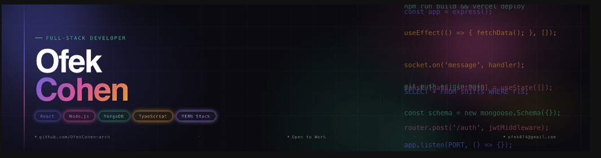

  

# Hi, I'm Ofek Cohen! 👋

I'm a passionate **Full-Stack Developer** and a proud graduate of **Coding Academy Israel**. I love building scalable, user-centric web applications and solving complex technical challenges. I'm currently dedicating my time to intensive daily development and pushing the boundaries of what I can build.

### 🛠 Tech Stack
* **Frontend:** React, TypeScript, CSS
* **Backend:** Node.js, Express.js
* **Database:** MongoDB, Supabase (PostgreSQL)
* **Real-time:** Socket.io, Supabase Channels
* **Tools:** Git, GitHub, REST APIs, AI Integration (OpenAI API)

### 🚀 Featured Projects

#### [LEO - Freelance Marketplace](https://github.com/Proudjew12/fiverr-clone.git)
A full-stack Fiverr-clone featuring:
* Real-time chat using Socket.io.
* Dynamic gig management and reviews.
* Built with the MERN stack.

#### [GasStationPro - SaaS Shift Management](https://github.com/OfekCohen-arch/GasStationPro.git)
A multi-tenant SaaS platform for gas stations:
* Serverless architecture with Supabase.
* Secure data isolation using PostgreSQL RLS.
* AI-powered assistant using GPT-4 for conflict-free scheduling.

---
### 📊 GitHub Stats

  

---
📫 **How to reach me:**  
[]
